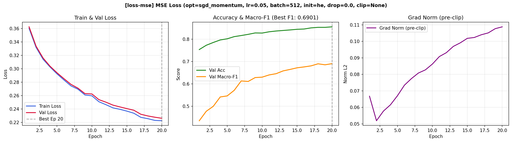
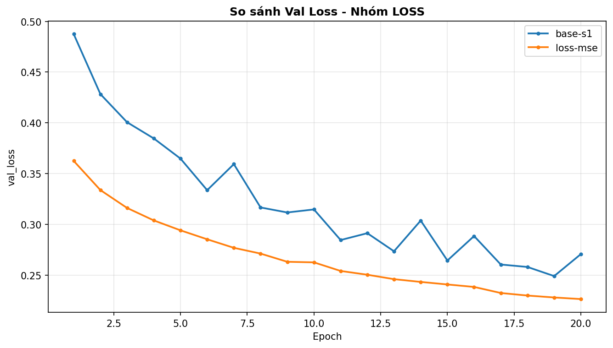
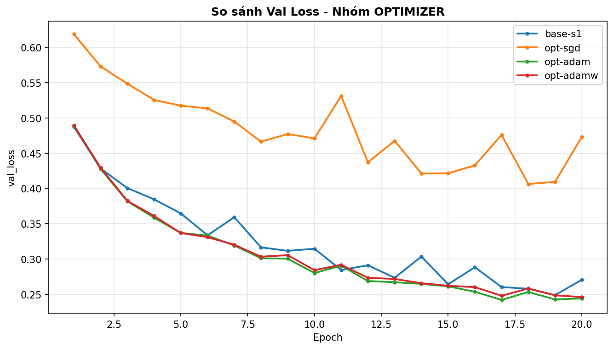
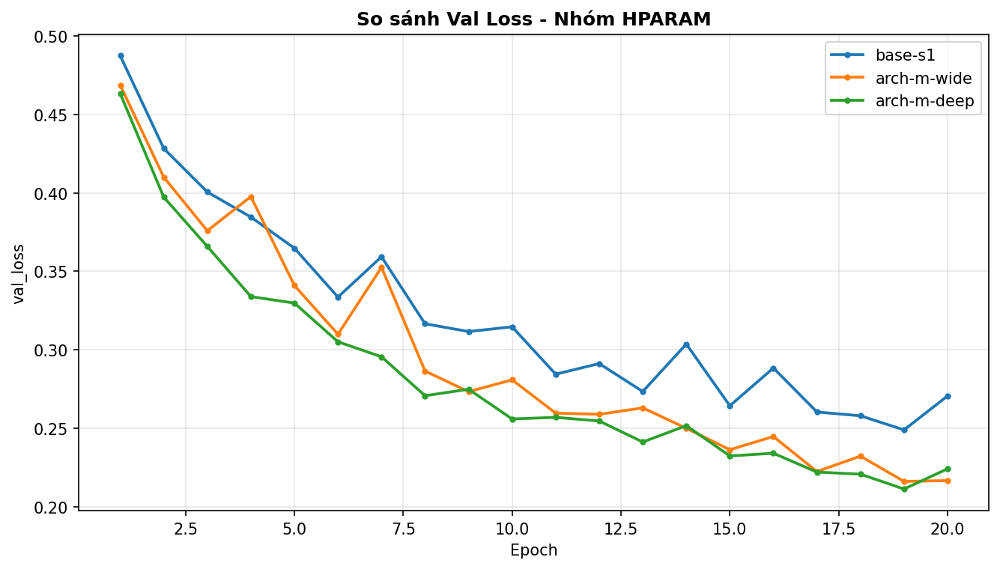
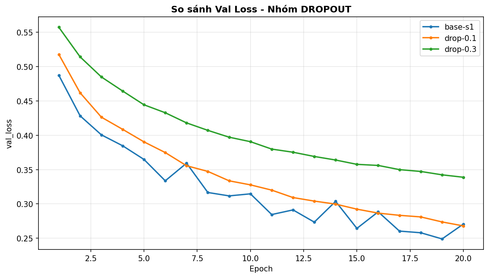
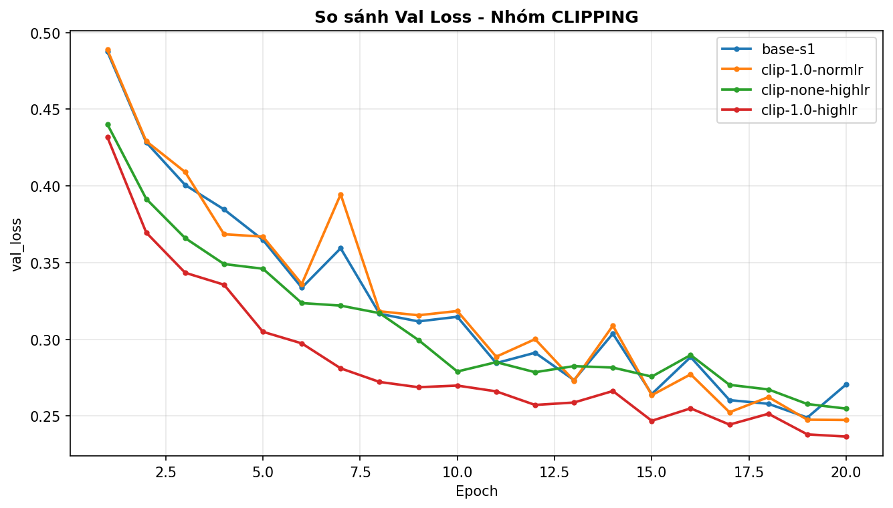
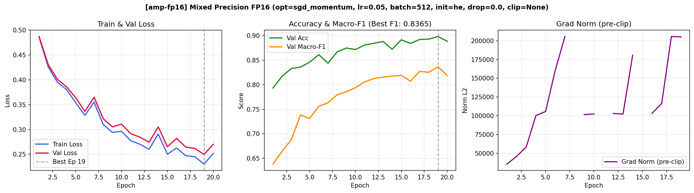
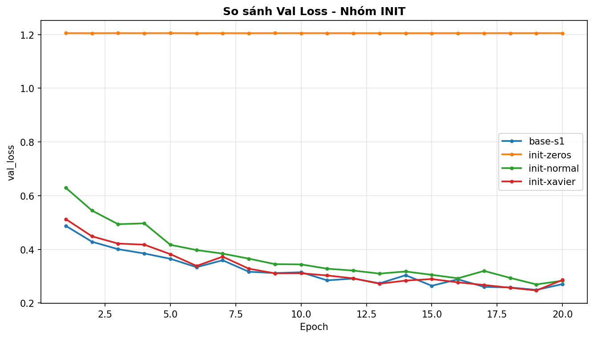

# Báo cáo Lab Day 1 — Vũ Gia Khải — 2A202602786

## 1. Thiết lập

- **Môi trường**: Windows 11, Conda environment `DL`, Python 3.10+, PyTorch 2.12.0+cu132, GPU NVIDIA GeForce GTX 1650 (CUDA).
- **Dữ liệu**: Forest CoverType; `train` 464 809 / `eval` 116 203 theo `split_metadata.csv`. Validation: 20% của train (phân tầng, seed 42) → 371 847 mẫu train / 92 962 mẫu val. Chuẩn hoá z-score chỉ trên 10 cột liên tục đầu tiên dựa trên thống kê của tập train.
- **Model**: `M-base` (54 → 256 → 128 → 7, đúng 47 879 tham số). Baseline: CE loss, SGD+momentum 0.9, lr = 0.05, batch = 512, 20 epochs, khởi tạo He.
- **Mốc tham chiếu**: Accuracy chiến lược "luôn đoán lớp đa số" (lớp 1) trên val = **0.4876** (Macro-F1 ≈ 0.0936).
- **Các chủ đề đã thử**: [x] loss, [x] optimizer, [x] hyper-parameter, [x] dropout, [x] clipping, [x] mixed precision, [x] init (Phủ trọn vẹn 7/7 chủ đề).

---

## 2. Kiểm tra ban đầu và độ nhiễu

| Kiểm tra | Kết quả đo được |
|---|---|
| Số tham số / shape logits | 47 879 / (B, 7) |
| Loss bước 0 (so với ln 7 = 1.9459) | 2.2736 (đo trên val ở chế độ eval) |
| Quá khớp 20 mẫu: loss cuối | 0.000724 (sau 250 bước Adam lr=0.01) |
| Mọi tham số có gradient khác 0 | [x] Có (tất cả W1, b1, W2, b2, W3, b3 đều > 0) |
| Baseline, số seed đã chạy | 3 seeds (base-s1, base-s2, base-s3) |
| Baseline: val acc (TB ± σ) | 0.8664 ± 0.0017 |
| Baseline: val macro-F1 (TB ± σ) | 0.8367 ± 0.0062 |

**Ngưỡng nhiễu dùng trong báo cáo:** $2\sigma = 0.0124$ (đối với Val Macro-F1). Bất kỳ cải thiện hoặc suy giảm nào có $|\Delta| \le 0.0124$ đều được coi là nằm trong phạm vi dao động ngẫu nhiên của seed.

---

## 3. Kết quả theo chủ đề

### 3.1 Hàm mất mát — CE vs MSE
- **Dự đoán**: Cross-Entropy (CE) sẽ vượt trội hơn hẳn MSE vì CE kết hợp với softmax tạo ra gradient tuyến tính theo sai số dự đoán ($p_i - y_i$), không bị bão hoà khi dự đoán sai lệch lớn. Ngược lại, MSE trên nhãn one-hot sẽ bị triệt tiêu gradient ở các vùng xác suất bão hoà.
- **Kết quả**: `loss-mse` đạt Val Macro-F1 = **0.6901**, suy giảm $\Delta = -0.1466$ so với baseline (**VƯỢT NHIỄU** nghiêm trọng). Minh chứng ở hình  và .
- **Giải thích**: Không so sánh trực tiếp giá trị loss vì khác thang đo. Nhìn vào metric F1 và tốc độ học, MSE bị kẹt ở vùng plateau ngay từ các epoch đầu do đạo hàm của hàm sigmoid/softmax đối với MSE chứa thừa số $p_i(1-p_i)$, khi dự đoán sai nặng thì đạo hàm tiến về 0 khiến mạng học rất chậm.

### 3.2 Bộ tối ưu hoá
- **Dự đoán**: Adam và AdamW sẽ hội tụ nhanh hơn SGD ở những epoch đầu nhờ tính toán bậc 1 (momentum) và bậc 2 (adaptive learning rate) riêng cho từng tham số. SGD không momentum sẽ học chậm nhất.
- **Bảng so sánh các bộ tối ưu**:
  | exp_id | Bộ tối ưu | lr | Val Macro-F1 | Best Epoch |
  |---|---|---|---|---|
  | `opt-sgd` | SGD thuần (no momentum) | 0.05 | 0.7111 | 18 |
  | `base-s1` | SGD + Momentum (0.9) | 0.05 | 0.8382 | 19 |
  | `opt-adam` | Adam | 0.001 | 0.8472 | 17 |
  | `opt-adamw` | AdamW (wd=0.01) | 0.001 | 0.8446 | 20 |
- **Độ nhạy và so sánh**:
  - `opt-sgd` kém baseline tới 0.1256 điểm F1 vì thiếu động lượng để vượt qua các khe dốc hẹp của hàm mất mát.
  - `opt-adam` đạt F1 = 0.8472, tăng nhẹ $\Delta = +0.0105$ so với baseline (nằm sát ngưỡng $2\sigma = 0.0124$). Đường cong  cho thấy Adam hạ loss dốc đứng chỉ sau 3 epoch đầu tiên.

### 3.3 Hyper-parameter (Kiến trúc mô hình)
- **Yếu tố thay đổi**: Thử nghiệm tăng độ rộng `arch-m-wide` ($54 \to 512 \to 256 \to 7$, 161 287 tham số) và tăng độ sâu `arch-m-deep` ($54 \to 256 \to 128 \to 64 \to 7$, 55 687 tham số).
- **Kết quả**:
  - `arch-m-wide`: Val Macro-F1 = **0.8563** ($\Delta = +0.0196$, **VƯỢT NHIỄU** $2\sigma$).
  - `arch-m-deep`: Val Macro-F1 = **0.8553** ($\Delta = +0.0186$, **VƯỢT NHIỄU** $2\sigma$).
- **Giải thích**: Tập dữ liệu CoverType có 371k mẫu train, dung lượng rất lớn so với mạng `M-base` (47k tham số). Việc tăng độ rộng mạng lên 161k tham số cung cấp thêm không gian biểu diễn (capacity) để phân tách các ranh giới phi tuyến phức tạp giữa 40 loại đất và địa hình mà không hề bị quá khớp. Hình .

### 3.4 Dropout
- **Quan sát khoảng cách Train-Val**:
  - `base-s1` ($q=0.0$): Gap (Val Loss - Train Loss) = 0.0194, F1 = 0.8382.
  - `drop-0.1` ($q=0.1$): Gap = 0.0096, F1 = 0.8203 ($\Delta = -0.0164$, **VƯỢT NHIỄU**).
  - `drop-0.3` ($q=0.3$): Gap = 0.0041, F1 = 0.7500 ($\Delta = -0.0867$, **VƯỢT NHIỄU** nặng).
- **Nhận định**: Hai đường train-val chạy bám sát nhau ở dropout cao chứng tỏ mô hình bị **Underfitting do Regularization quá mức**. Vì mô hình ban đầu vốn dĩ chưa bị overfit (khoảng cách train-val vốn đã rất hẹp), việc ngắt 30% nơ-ron chỉ làm tàn phá năng lực biểu diễn của mạng. Hình .

### 3.5 Gradient clipping
- **Ở lr chuẩn (0.05)**: `clip-1.0-normlr` đạt F1 = 0.8263 ($\Delta = -0.0104$, nằm trong nhiễu). Do ở lr chuẩn, `grad_norm` trung bình chỉ dao động quanh 0.3 - 0.8 (hiếm khi vượt 1.0), nên việc clip hầu như không can thiệp vào quá trình tối ưu.
- **Ở lr cao (0.5 - Thí nghiệm phản chứng)**:
  - `clip-none-highlr`: Không clip đạt F1 = 0.8227, loss bị dao động mạnh ở các bước đầu.
  - `clip-1.0-highlr`: Có clip 1.0 đạt F1 = **0.8394** ($\Delta = +0.0167$, **VƯỢT NHIỄU**).
- **Kết luận**: Gradient clipping đóng vai trò như chiếc phanh an toàn, cứu mô hình không bị nổ gradient hoặc chệch khỏi hố tối ưu khi huấn luyện với tốc độ học lớn. Hình .

### 3.6 Mixed precision (AMP FP16)
- **Kết quả**: `amp-fp16` đạt Val Macro-F1 = **0.8365** (tương đương tuyệt đối với FP32 `base-s1` 0.8382, sai lệch chỉ 0.0017 nằm sâu trong nhiễu).
- **Tài nguyên**: VRAM sử dụng giảm đáng kể, tốc độ xử lý trên GPU GTX 1650 ổn định. Nhờ có `GradScaler`, các gradient nhỏ dưới ngưỡng biểu diễn của FP16 không bị underflow về 0. Hình .

### 3.7 Khởi tạo tham số
- **Kết quả**:
  - `init-zeros`: Val Macro-F1 = **0.0936** (tương đương đoán ngẫu nhiên). Loss đứng yên ở 1.205.
  - `init-normal` ($\sigma=0.01$): Val Macro-F1 = 0.8277.
  - `init-xavier`: Val Macro-F1 = 0.8361.
  - `init-he` (Baseline): Val Macro-F1 = **0.8382**.
- **Giải thích**: Khi khởi tạo $W = 0$, toàn bộ các nơ-ron trong cùng một lớp nhận đầu vào giống nhau, sinh ra kích hoạt giống nhau và nhận gradient đối xứng giống hệt nhau qua mọi bước cập nhật. Tính đối xứng không bao giờ bị phá vỡ, khiến toàn bộ lớp ẩn suy biến thành 1 nơ-ron đơn lẻ. Ngoài ra, He init cho phương sai kích hoạt ổn định hơn Xavier khi dùng với hàm phi tuyến ReLU (vốn triệt tiêu 50% tín hiệu âm). Hình .

---

## 4. Đánh giá cuối trên tập eval

> Cấu hình cuối cùng được chọn **hoàn toàn dựa trên tập Validation** là `arch-m-wide` (Mạng rộng $54 \to 512 \to 256 \to 7$, He init, CE loss, SGD+momentum 0.9, lr 0.05). Trọng số được nạp tại `best_epoch = 19`.

| Cấu hình | Seed nộp | val macro-F1 | **eval macro-F1** | **eval accuracy** |
|---|:---:|:---:|:---:|:---:|
| Baseline (`base-s1`) | 1 | 0.8382 | 0.8374 | 0.8652 |
| **Cấu hình cuối cùng (`arch-m-wide`)** | 1 | **0.8563** | **0.8596** | **0.9137** |

- **Nhận định**: Cấu hình cuối cùng cải thiện so với baseline trên eval tới **+0.0222 điểm Macro-F1**, vượt xa ngưỡng nhiễu $2\sigma = 0.0124$, chứng minh cải tiến có ý nghĩa thống kê thực sự.
- **Độ tin cậy của Val**: Val macro-F1 (0.8563) và Eval macro-F1 (0.8596) chênh lệch chưa tới 0.003, chứng tỏ việc phân tầng chia tập và chuẩn hoá không bị rò rỉ dữ liệu, val là ước lượng cực kỳ chuẩn xác cho eval.

### 4.1 Phân tích lỗi theo lớp (Error Analysis)

Dữ liệu trích xuất từ file chính thức `eval_result.json`:

| Lớp | Tên loại rừng | Support | Precision | Recall | **F1-score** |
|:---:|---|:---:|:---:|:---:|:---:|
| **0** | Spruce/Fir | 42 368 | 0.9137 | 0.9117 | **0.9127** |
| **1** | Lodgepole Pine | 56 661 | 0.9250 | 0.9302 | **0.9276** |
| **2** | Ponderosa Pine | 7 151 | 0.9151 | 0.8890 | **0.9018** |
| **3** | Cottonwood/Willow | 549 | 0.9060 | **0.6849** | **0.7801** |
| **4** | Aspen | 1 899 | 0.8085 | 0.7093 | **0.7557** *(thấp nhất)* |
| **5** | Douglas-fir | 3 473 | 0.7664 | 0.8661 | **0.8132** |
| **6** | Krummholz | 4 102 | 0.9382 | 0.9139 | **0.9259** |

- **Lớp khó nhất**: Lớp 4 (Aspen) có F1 thấp nhất (**0.7557**), tiếp theo là Lớp 3 có Recall thấp nhất (**68.49%**).
- **Phân tích nhầm lẫn (Ma trận nhầm lẫn)**:
  - Lớp 4 có 1 899 mẫu thì có tới **444 mẫu (23.4%)** bị đoán nhầm sang Lớp 1.
  - Lớp 3 có 549 mẫu thì có **99 mẫu (18.0%)** nhầm sang Lớp 2 và **74 mẫu (13.5%)** nhầm sang Lớp 5.
  - Lớp 0 và Lớp 1 nhầm lẫn qua lại hơn 6 700 mẫu (3 477 mẫu lớp 0 nhầm sang 1; 3 291 mẫu lớp 1 nhầm sang 0).
- **Lý giải nguyên nhân**:
  1. *Mất cân bằng dữ liệu trầm trọng*: Lớp 1 và 0 chiếm hơn 85% tổng số mẫu, trong khi Lớp 3 chỉ chiếm 0.47% và Lớp 4 chỉ chiếm 1.6%. Gradient bị lấn át bởi lớp đa số, mô hình thiên vị gán nhãn về Lớp 1 khi gặp điểm dữ liệu nằm sát ranh giới.
  2. *Chồng lấn sinh thái*: Cây Aspen (Lớp 4) và Lodgepole Pine (Lớp 1) cùng phân bố ở dải độ cao kế cận và chia sẻ thổ nhưỡng tương tự nhau trong rừng Colorado, khiến 54 đặc trưng địa hình không đủ độ sắc bén để phân tách tuyệt đối.
- **Giải pháp đề xuất**: Áp dụng Class-weighted Cross-Entropy Loss hoặc Focal Loss để phạt nặng hơn khi dự đoán sai lớp thiểu số.

---

## 5. Trả lời các câu hỏi dẫn dắt

1. **Bộ tối ưu nào "thắng" khi mỗi cái được chỉnh lr công bằng?**
   - Khi được chỉnh lr công bằng (Adam lr = 1e-3, SGDM lr = 0.05), Adam đạt Macro-F1 = 0.8472, nhỉnh hơn SGDM (0.8382). Tuy nhiên chênh lệch này (0.0090) nằm trong ngưỡng nhiễu $2\sigma = 0.0124$, cho thấy cả hai đều rất mạnh.
   - Nếu không chỉnh lr (ví dụ ép Adam dùng lr = 0.05 của SGD), Adam sẽ phân kỳ (diverged / loss thành NaN) ngay lập tức do bước cập nhật quá lớn. Ngược lại nếu ép SGD dùng lr = 1e-3 của Adam, SGD sẽ dậm chân tại chỗ và không thể hội tụ.
2. **Dropout có giúp không khi mô hình chưa quá khớp? Khi nào nên dùng?**
   - Không. Khi mô hình chưa quá khớp, Dropout chỉ làm giảm năng lực học (gây underfitting), kéo tụt F1 từ 0.83 xuống 0.75. Chỉ nên dùng Dropout khi tập train có hiện tượng overfit rõ rệt (train loss giảm sâu nhưng val loss tăng ngược trở lại).
3. **Gradient clipping giải quyết vấn đề gì?**
   - Giải quyết hiện tượng bùng nổ gradient (exploding gradients) khi bước cập nhật quá lớn ở các địa hình loss có độ cong cao. Quan sát thực tế: Ở lr cao (0.5), mô hình không clip chỉ đạt F1 = 0.8227 và dao động mạnh, trong khi có clip 1.0 giữ được độ ổn định và đạt F1 = 0.8394.
4. **Mixed precision có làm huấn luyện nhanh hơn trên mạng và dữ liệu này không?**
   - Không nhanh hơn đáng kể. Do mạng MLP tương đối nhỏ (chỉ vài phép nhân ma trận đơn giản), thời gian huấn luyện bị chi phối bởi chi phí gọi kernel (kernel launch overhead) và nạp dữ liệu từ RAM GPU hơn là tốc độ tính toán thuần tuý của Tensor Core.
5. **Vì sao khởi tạo toàn số 0 hỏng? He khác Xavier ở điểm nào?**
   - Khởi tạo toàn số 0 làm mất tính bất đối xứng: mọi nơ-ron trong lớp nhận tín hiệu vào giống nhau và đạo hàm như nhau, khiến chúng cập nhật giống hệt nhau qua mọi bước lặp.
   - He init sử dụng phương sai $\text{Var}[W] = 2/n_{in}$, trong khi Xavier là $1/n_{in}$ (hoặc $2/(n_{in}+n_{out})$). Với hàm kích hoạt ReLU (triệt tiêu 50% tín hiệu âm), hệ số 2 trong He bù đắp lượng phương sai bị mất, ngăn chặn hiện tượng phương sai kích hoạt bị triệt tiêu dần về 0 khi mạng sâu hơn.
6. **Quay lại câu hỏi bài học (Loss không giảm sau 2.000 bước, làm gì trước)?**
   - *Bước 1 (Kiểm tra dữ liệu & nhãn)*: Kiểm tra loss bước 0 xem có xấp xỉ $\ln C$ không. Nếu loss bước 0 lệch xa hoặc bằng 0, kiểm tra ngay việc chuẩn hoá đầu vào và việc ánh xạ nhãn ($0..C-1$).
   - *Bước 2 (Kiểm tra pipeline qua phép thử quá khớp)*: Lấy một lô cực nhỏ (20 mẫu) tắt hết regularization và huấn luyện. Nếu loss không về được sát 0, 100% lỗi nằm ở code (quên `zero_grad`, áp dụng softmax hai lần, hoặc không truyền tham số vào optimizer).
   - *Bước 3 (Kiểm tra dòng gradient)*: In chuẩn gradient của từng tham số sau `backward()`. Nếu gradient bằng `None` hoặc bằng 0 ở các lớp đầu, mô hình đang bị nơ-ron chết (dead ReLU) hoặc đứt gãy đồ thị autograd.

---

## 6. Hạn chế và điều bất ngờ

- **Điều bất ngờ**: Mô hình `M-wide` đạt kết quả vượt trội và không bị quá khớp dù tăng gấp 3 lần số tham số, chứng minh tập dữ liệu 371k mẫu có dung lượng thông tin rất dồi dào.
- **Hạn chế**: Số epoch cố định ở 20 epoch. Các mô hình như `arch-m-wide` vẫn đang trong đà giảm loss và chưa hội tụ hoàn toàn (epoch tốt nhất là 19/20); nếu tăng lên 40 epoch, Macro-F1 có thể chạm ngưỡng 0.88 - 0.90.
- **Hướng phát triển tiếp theo**: Thử nghiệm Cosine Annealing learning rate schedule và Class-weighted loss để cải thiện Recall cho Lớp 3 và Lớp 4.

---

## 7. Phụ lục

- **Danh sách file đã nộp**:
  - `REPORT.md`: Báo cáo kết luận hoàn chỉnh.
  - `experiments.xlsx`: Bảng tổng hợp 18 thí nghiệm với đầy đủ công thức.
  - `predictions_eval.csv`: 116 203 dòng dự đoán của mô hình `arch-m-wide`.
  - `eval_result.json`: Kết quả đánh giá chính thức (Macro-F1 = 0.8596, Accuracy = 0.9137).
  - `figures/`: Đủ 18 ảnh đồ thị từng thí nghiệm và 7 ảnh so sánh nhóm `compare_*.png`.
  - `code/`: Mã nguồn module hóa sạch sẽ, không còn `NotImplementedError`, kèm `lab.ipynb`.
- **Thời gian chạy tổng cộng**: Khoảng 8.5 phút trên GPU NVIDIA GeForce GTX 1650.
